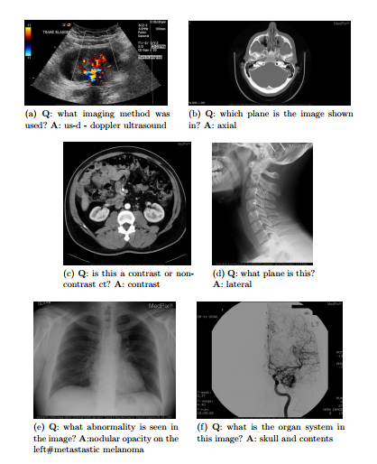
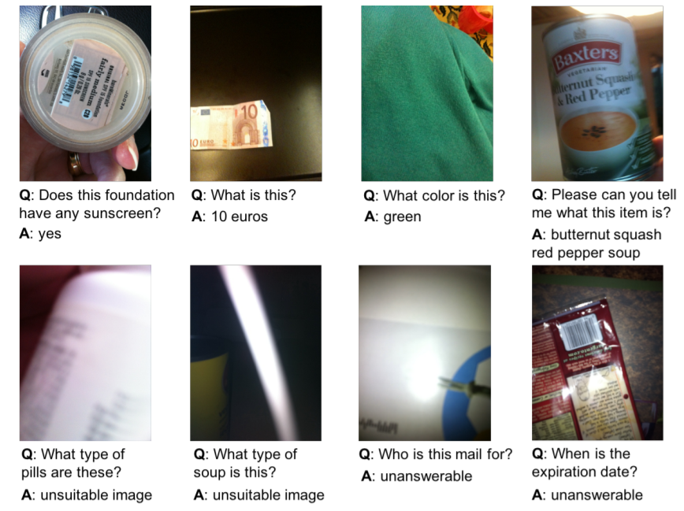
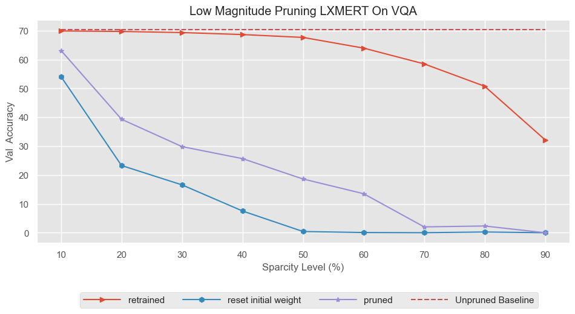
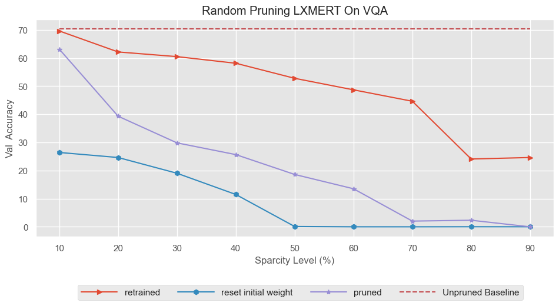
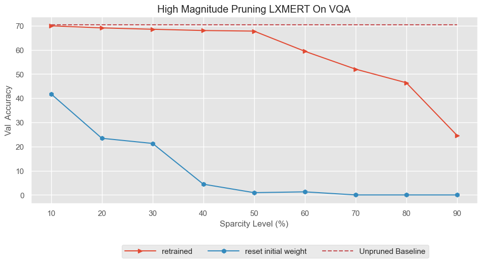
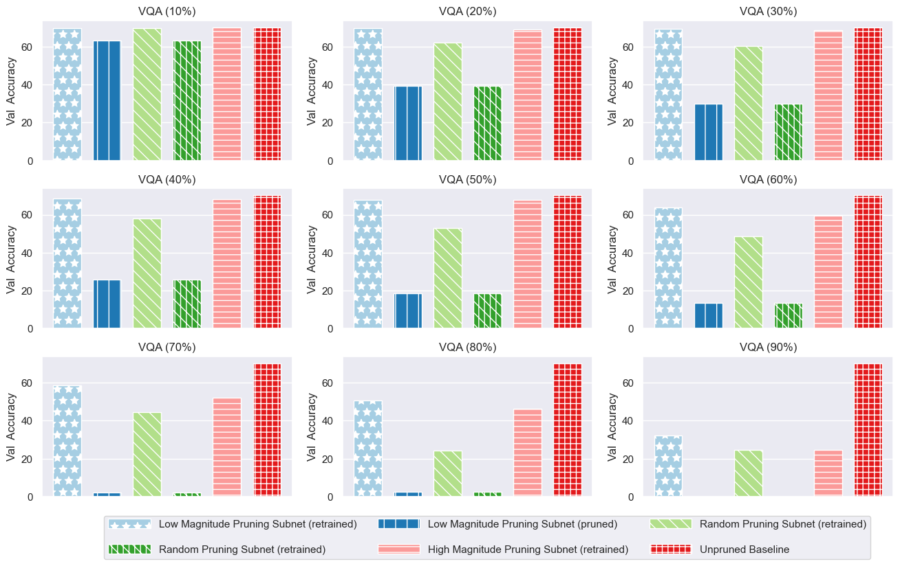
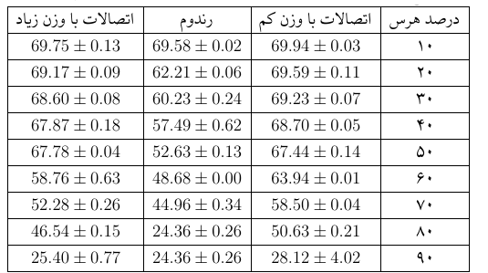

# LXMERT Model Compression for Visual Question Answering
This project implementation is built on the great repo of [LXMERT](https://github.com/airsplay/lxmert) and PyTorch code for the EMNLP 2019 paper ["LXMERT: Learning Cross-Modality Encoder Representations from Transformers"](https://arxiv.org/abs/1908.07490) on VQA v2.0.

**See the complete report [here](https://github.com/ghazaleh-mahmoodi/lxmert_compression/blob/main/report/main.pdf) ([Latex Template](https://www.overleaf.com/latex/templates/thesis-for-iran-university-of-science-and-technology-pyn-nmh-bry-dnshgh-lm-wsnt-yrn/dmqfwdysjgmj) at overleaf).**

**Slides of project representation are available [here](https://github.com/ghazaleh-mahmoodi/lxmert_compression/blob/main/BS_FinalProject_Presentation.pdf) ([Google Docs](https://docs.google.com/presentation/d/156CAv8Zpmc-XrgZtH6hOLUKT4LKQS9YmIdAWiaOAEFY/edit?usp=sharing)).**

**Abstract Paper Accepted in [WeCNLP](https://www.wecnlp.ai/wecnlp-2021/posters) is available [here](https://github.com/ghazaleh-mahmoodi/lxmert_compression/blob/main/WeCNLP_VQA.pdf).**

# Visual Question Answering Usage
## Medical Visual Question Answering
["VQA-Med: Overview of the Medical Visual Question Answering Task at ImageCLEF 2019"](http://ceur-ws.org/Vol-2380/paper_272.pdf)

## Answering Visual Questions from Blind People
["VizWiz Grand Challenge: Answering Visual Questions from Blind People"](https://arxiv.org/pdf/1802.08218.pdf)

# Summary
Large-scale pretrained models such as LXMERT are becoming popular for learning cross-modal representations on text-image pairs for vision-language tasks. According to the lottery ticket hypothesis, NLP and computer vision models contain smaller subnetworks capable of being trained in isolation to full performance. In this project, we combine these observations to evaluate whether such trainable subnetworks exist in LXMERT when fine-tuned on the VQA task. In addition, we perform a model size cost-benefit analysis by investigating how much pruning can be done without significant loss in accuracy.

# Run

## Install the required packages
```bash
pip3 install -r requirements.txt
```

## Run All Experiment
to run all experiment ,in lxmert folder run following command:
```bash
bash run/vqa_run.bash
```

# Results 
- The plots are available in `lxmert/result` directory.
- The trained models are available in `lxmert/models` directory.
- The logs are available in `lxmert/logs` directory.

## Plots
### Low Magnitude Pruning Subnetwork 


***

### Random Pruning Subnetwork 


***

### High Magnitude Pruning Subnetwork 


*** 

### All Result Based on Pruning Sparcity


***

### All Result Based on Pruning mode

